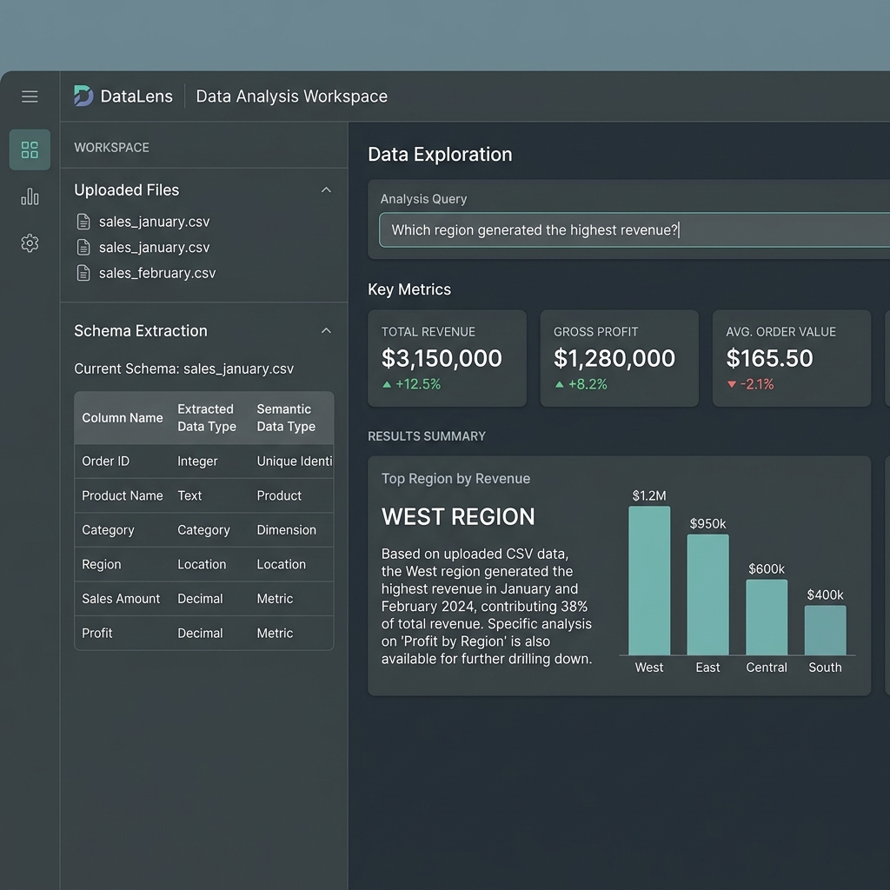
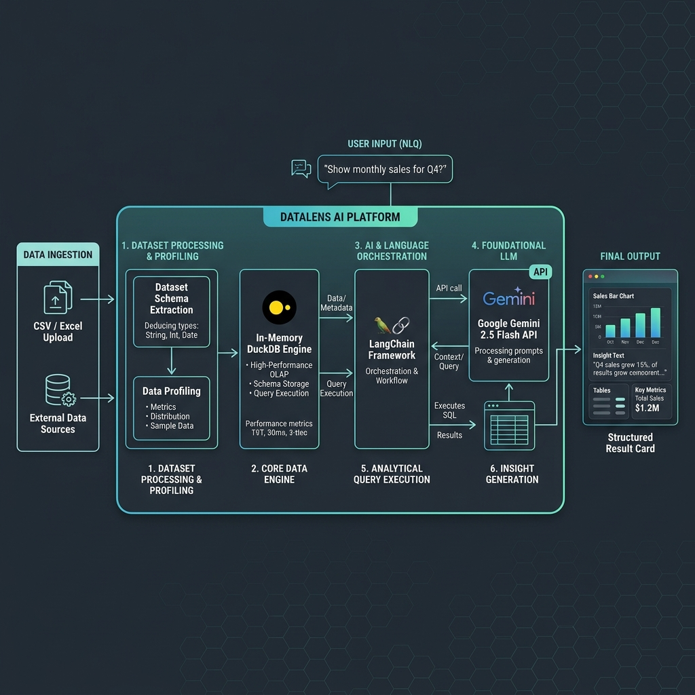

# ◈ DataLens — AI-Powered Data Analysis Workspace

> **Ask analytical questions about your CSV and Excel datasets in plain English with 100% mathematical accuracy.**

DataLens combines **Google Gemini 2.5 Flash**, **LangChain**, and **DuckDB** to deliver a reliable, deterministic analytical product. Gemini interprets analytical intent into SQL, DuckDB executes the exact mathematical computations, and Gemini synthesizes clear, executive-ready explanations.



---

## 🌟 Key Features

* **Deterministic Computation**: **Gemini never calculates numbers directly.** Intent is translated into DuckDB SQL, ensuring exact, verifiable, and zero-hallucination math.
* **Automatic CSV & Excel Ingestion**: Upload single or multiple `.csv`, `.xlsx`, and `.xls` files.
* **Deep Schema Extraction & Profiling**:
  * Physical & semantic data type detection (`currency`, `measure`, `quantity`, `percentage`, `date`, `datetime`, `categorical`, `identifier`, `boolean`, `text`).
  * Instant summary statistics (`min`, `max`, `mean`, `null_count`, `null_pct`, `unique_count`, and representative sample values).
  * Interactive **View Schema** extraction table.
* **Flexible Scope Control**:
  * **Current File**: Query a single selected dataset.
  * **Selected Files**: Query specific chosen datasets.
  * **All Compatible Files**: Seamlessly query across compatible files via automated `UNION ALL` views.
* **Dataset Summarization**:
  * **Individual Summary**: Structured overview, key metrics, and key observations for a single file.
  * **Combined Summary**: Cross-file overall picture, combined metrics, and file-to-file comparison.
* **Read-Only SQL Safety**: Whitelisted analytical queries (`SELECT`, `WITH`) with strict rejection of destructive statements (`DROP`, `DELETE`, `INSERT`, `UPDATE`, `ALTER`, `TRUNCATE`, injection attempts).
* **Self-Healing SQL Retries**: Automatic error recovery loop (up to 2 retries) with error context feedback if SQL execution fails.
* **Professional UI**: Slate & teal analytical workspace design with clear hierarchy, key metric cards, supporting data tables, and collapsible analysis details (generated SQL, scope, status).

---

## 📐 System Architecture



```text
CSV / XLSX Uploads
       ↓
File Ingestion & Schema Profiling (physical dtypes, semantic types, null %, min/max/mean)
       ↓
DuckDB Session Storage (In-Memory OLAP Engine)
       ↓
User Question + Structured Context Builder
       ↓
LangChain + System Prompt + Gemini 2.5 Flash
       ↓
SQL Generation & Safety Validation (Read-Only Whitelist)
       ↓
DuckDB Query Execution (Deterministic Computation)
       ↓
Gemini Result Explanation & Metrics Cards
       ↓
Streamlit Workspace UI
```

---

## 💡 Why This Stack?

### Why DuckDB over In-Memory Python Loops?
- **DuckDB** is a high-performance in-memory OLAP SQL database capable of executing aggregations, joins, window functions, and group-bys across millions of rows in milliseconds.
- Runs embedded inside Python with zero external service setup.

### Why SQL Generation over RAG (Vector Databases)?
Tabular analytics is a **structured data problem**, not a text retrieval problem. Vector embeddings and similarity search approximate text contexts, whereas business analytics requires **exact mathematical precision**:
- **Zero Numerical Hallucinations**: DuckDB performs the arithmetic, not the LLM.
- **Auditable & Traceable**: Every answer displays the exact generated SQL query in the *Analysis Details* panel.

---

## 🛠️ Technology Stack

| Component | Technology | Purpose |
|---|---|---|
| **Frontend UI** | Streamlit | Responsive single-page analytical workspace |
| **Database Engine** | DuckDB | Embedded OLAP database for fast SQL calculations |
| **Data Handling** | Pandas & OpenPyXL | File loading, sheet parsing, and data manipulation |
| **LLM Orchestration** | LangChain | Structured message handling and model chain management |
| **AI Model** | Google Gemini API (`gemini-2.5-flash`) | SQL generation, result interpretation, and summarization |
| **Testing** | Pytest | Automated verification test suite |

---

## 🚀 Quick Start Guide

### Prerequisites
- Python 3.10+ (tested on Python 3.14)
- Git

### 1. Clone the Repository
```bash
git clone https://github.com/Karthikeyavuyyuru1610/ai-data-analyst.git
cd ai-data-analyst
```

### 2. Install Dependencies
```bash
pip install -r requirements.txt
```

### 3. Configure Environment Variables
Copy the `.env.example` template to `.env` and add your **Gemini API Key**:
```bash
cp .env.example .env
```
Edit `.env`:
```env
GEMINI_API_KEY=your_actual_gemini_api_key_here
GEMINI_MODEL=gemini-2.5-flash
```

### 4. Run the Web Application
```bash
streamlit run app.py
```
Open **`http://localhost:8501`** in your browser.

---

## 🧪 Testing & Validation

Generate sample test datasets and run the full 37-point test suite:

```bash
# 1. Generate sample CSV datasets (sales_january, sales_february, sales_march)
python generate_sample_data.py

# 2. Run the automated Pytest test suite
python -m pytest tests/test_validation.py -v
```

### Test Suite Scope
- Total & Average Revenue computations (Single & Multi-file)
- Top Product & Region identification
- Customer Counting & Distinct aggregations
- Profit calculations handling NULL values
- Monthly Revenue comparisons & Product growth trends
- Dataset Summarization engine
- SQL Safety & Destructive query rejection
- Schema Compatibility detection

---

## 📁 Repository Structure

```
ai-data-analyst/
├── app.py                      # Main Streamlit workspace UI
├── core/
│   ├── __init__.py
│   ├── ingestion.py            # File loading, profiling, & semantic type detection
│   ├── database.py             # DuckDB session & table management
│   ├── llm.py                  # LangChain + Gemini integration & prompts
│   ├── sql_safety.py           # SQL safety validator & parser
│   └── visualization.py        # Charting & metrics utilities
├── assets/
│   ├── workspace_preview.png   # UI screenshot
│   └── architecture_diagram.png # Technical architecture diagram
├── sample_data/                # Sample CSV test datasets
├── tests/
│   ├── __init__.py
│   └── test_validation.py      # 37 validation tests
├── generate_sample_data.py     # Sample data generator script
├── requirements.txt            # Python dependencies
├── .env.example                # Environment variables template
├── .gitignore                  # Git ignore rules
└── README.md                   # Project documentation
```

---

## 🔒 Security & Privacy

- **API Key Protection**: `.env` is ignored by Git to prevent API key leaks.
- **Read-Only Database Enforcement**: Destructive operations (`DROP`, `DELETE`, `UPDATE`, `INSERT`, `ALTER`, `TRUNCATE`) are blocked by `sql_safety.py`.
- **Zero Raw Data Transmission**: Only schema metadata, column statistics, and sample values are sent to the Gemini API — raw data rows remain local in DuckDB.

---

## 📜 License

MIT License — free to use and extend for commercial and research applications.
